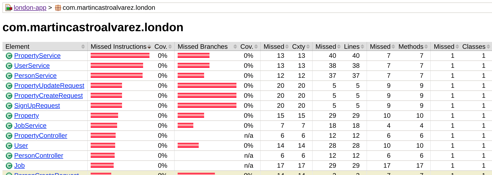

# Java Sprint Boot
Authentication, Authorization, SQL, Async tasks, Unit Tests, Code Coverage.


## Rerferences

- [Building an Application with Spring Boot](https://spring.io/guides/gs/spring-boot/)
- [Spring Boot Examples](https://github.com/mkyong/spring-boot)
- [Spring Boot – Starters](https://www.geeksforgeeks.org/spring-boot-starters/)
- [Spring Boot Actuator](https://www.baeldung.com/spring-boot-actuators)
- [Using Logback with Spring Boot](https://springframework.guru/using-logback-spring-boot/)
- [@Controller and @RestController Annotations in Spring Boot](https://stackabuse.com/controller-and-restcontroller-annotations-in-spring-boot/)
- [Spring Data JPA - Reference Documentation](https://docs.spring.io/spring-data/jpa/docs/current/reference/html/#repositories.limit-query-result)
- [Jackson Project Home @github](https://github.com/FasterXML/jackson)
- [Java Map Class](https://docs.oracle.com/javase/8/docs/api/java/util/Map.html)
- [Spring Boot Connect to PostgreSQL Database Examples](https://www.codejava.net/frameworks/spring-boot/connect-to-postgresql-database-examples)
- [Spring Boot PostgreSQL](https://zetcode.com/springboot/postgresql/)
- [Spring Boot + PostgreSQL + JPA/Hibernate CRUD Restful API Tutorial](https://www.javaguides.net/2019/01/springboot-postgresql-jpa-hibernate-crud-restful-api-tutorial.html)
- [Java 8 – Convert Optional<String> to String](https://mkyong.com/java8/java-8-convert-optionalstring-to-string/)
- [Personalizar las relaciones con @JoinColumn](https://www.oscarblancarteblog.com/2018/12/13/Personalizar-las-relaciones-con-joincolumn/)
- [Securing a Web Application](https://spring.io/guides/gs/securing-web/)
- [Hashing a Password in Java](https://www.baeldung.com/java-password-hashing)
- [Password authentication in Java](https://stackoverflow.com/questions/2860943/how-can-i-hash-a-password-in-java)
- [Pagination and Sorting using Spring Data JPA](https://www.baeldung.com/spring-data-jpa-pagination-sorting)
- [Spring @Async Annotation for Asynchronous Processing](https://www.digitalocean.com/community/tutorials/spring-async-annotation)
- [Introduction to Spring Testing](https://docs.spring.io/spring-framework/docs/current/reference/html/testing.html)
- [AssertJ Core](https://joel-costigliola.github.io/assertj/assertj-core-quick-start.html)

## Data Model

#### User
| Attribute | Type | Description |
| ---  | --- | --- |
| *id* | *int* | User unique identifier. |
| *name* | *string* | User name. |
| *password* | *string* | User hashed password. |

#### Job
| Attribute | Type | Description |
| ---  | --- | --- |
| *id* | *int* | Job id. |
| *createdAt* | *date* | Job creation date. |
| *startedAt* | *date* | Job start date. |
| *endedAt* | *date* | Job end date. |
| *status* | *int* | Job status (Pending, Started, Ended, Failed). |

#### Person
| Attribute | Type | Description |
| ---  | --- | --- |
| *id* | *int* | Person unique identifier. |
| *name* | *string* | Person name. |

#### Property
| Attribute | Type | Description |
| ---  | --- | --- |
| *id* | *int* | Property unique identifier. |
| *ownerId* | *int* | Owner unique identifier. |
| *name* | *string* | Property name. |

## API Documentation

#### Users
| Methd | Endpoint | Description |
| ---  | --- | --- |
| *POST* | */api/v1/auth/signup/* | Create an User. |
| *POST* | */api/v1/auth/logout/* | Logout endpoint. |
| *POST* | */api/v1/auth/login/* | Login endpoint. |
| *GET* | */api/v1/auth/session/* | Get session details. |
| *PUT* | */api/v1/auth/session/* | Update your User. |

#### Users
| Methd | Endpoint | Description |
| ---  | --- | --- |
| *GET* | */api/v1/jobs/* | List the latest jobs. |
| *GET* | */api/v1/jobs/:id* | Get one job by id. |

#### Persons
| Methd | Endpoint | Description |
| ---  | --- | --- |
| *GET* | */api/v1/persons/* | Lists persons. |
| *POST* | */api/v1/persons/* | Create a person. |
| *GET* | */api/v1/persons/:id/* | Person details. |
| *PUT* | */api/v1/persons/:id/* | Update person. |
| *DELETE* | */api/v1/persons/:id/* | Delete a person. |

#### Properties
| Methd | Endpoint | Description |
| ---  | --- | --- |
| *GET* | */api/v1/properties/* | Lists properties. |
| *POST* | */api/v1/properties/* | Create a Property. |
| *GET* | */api/v1/properties/:id/* | Property details. |
| *PUT* | */api/v1/properties/:id/* | Update Property. |
| *DELETE* | */api/v1/properties/:id/* | Delete a Property. |

## Software Architecture

#### Configuration

| File | Description |
| ---   | --- |
| [pom.xml](pom.xml) | Maven Configuration. |
| [application.properties](src/main/resources/application.properties) | Application Properties. |
| [Application.java](src/main/java/com/martincastroalvarez/london/Application.java) | Application Context. |
| [GlobalProperties.java](./src/main/java/com/martincastroalvarez/london/config/GlobalProperties.java) | Application Configuration. |

#### Controllers
| File | Description |
| ---   | --- |
| [RootController.java](./src/main/java/com/martincastroalvarez/london/controllers/RootController.java) | Root Endpoint. |
| [PersonController.java](./src/main/java/com/martincastroalvarez/london/controllers/PersonController.java) | Person API Resource. |
| [PropertyController.java](./src/main/java/com/martincastroalvarez/london/controllers/PropertyController.java) | Property API Resource. |
| [UserController.java](./src/main/java/com/martincastroalvarez/london/controllers/UserController.java) | User API Resource. |
| [JobController.java](./src/main/java/com/martincastroalvarez/london/controllers/JobController.java) | Job API Resource. |

#### Models
| File | Description |
| ---   | --- |
| [Person.java](./src/main/java/com/martincastroalvarez/london/models/Person.java) | Person model. |
| [Property.java](./src/main/java/com/martincastroalvarez/london/models/Property.java) | Property model. |
| [User.java](./src/main/java/com/martincastroalvarez/london/models/User.java) | User model. |
| [Job.java](./src/main/java/com/martincastroalvarez/london/models/Job.java) | Job model. |

#### Tasks
| File | Description |
| ---   | --- |
| [PersonTasks.java](./src/main/java/com/martincastroalvarez/london/tasks/PersonTasks.java) | Person tasks. |
| [PropertyTasks.java](./src/main/java/com/martincastroalvarez/london/tasks/PropertyTasks.java) | Property tasks. |

#### Repositories
| File | Description |
| ---   | --- |
| [PersonRepository.java](./src/main/java/com/martincastroalvarez/london/repositories/PersonRepository.java) | Person model repository. |
| [PropertyRepository.java](./src/main/java/com/martincastroalvarez/london/repositories/PropertyRepository.java) | Property model repository. |
| [UserRepository.java](./src/main/java/com/martincastroalvarez/london/repositories/UserRepository.java) | User model repository. |
| [JobRepository.java](./src/main/java/com/martincastroalvarez/london/repositories/JobRepository.java) | Job model repository. |

#### Services
| File | Description |
| ---   | --- |
| [PersonService.java](./src/main/java/com/martincastroalvarez/london/services/PersonService.java) | Person business logic. |
| [PropertyService.java](./src/main/java/com/martincastroalvarez/london/services/PropertyService.java) | Property business logic. |
| [UserService.java](./src/main/java/com/martincastroalvarez/london/services/UserService.java) | User business logic. |
| [JobService.java](./src/main/java/com/martincastroalvarez/london/services/JobService.java) | Job business logic. |

#### Exceptions
| File | Description |
| ---   | --- |
| [GlobalErrorHandler.java](./src/main/java/com/martincastroalvarez/london/errors/GlobalErrorHandler.java) | Catches exceptions globally and generates pretty JSON responses. |
| [ErrorResponse.java](./src/main/java/com/martincastroalvarez/london/responses/ErrorResponse.java) | Pretty representation of a Java exception. |
| [PersonNotFoundError.java](./src/main/java/com/martincastroalvarez/london/errors/PersonNotFoundError.java) | Person not found. |
| [PropertyNotFoundError.java](./src/main/java/com/martincastroalvarez/london/errors/PropertyNotFoundError.java) | Property not found. |
| [UserNotFoundError.java](./src/main/java/com/martincastroalvarez/london/errors/UserNotFoundError.java) | User not found. |
| [JobNotFoundError.java](./src/main/java/com/martincastroalvarez/london/errors/JobNotFoundError.java) | Job not found. |

#### Unit Tests
| File | Description |
| ---   | --- |
| [PersonApiTests.java](./src/test/java/com/martincastroalvarez/london/PersonApiTests.java) | Testing the Person . |
| [PersonControllerTests.java](./src/test/java/com/martincastroalvarez/london/PersonControllerTests.java) | Testing the Person controller. |
| [PersonRepositoryTests.java](./src/test/java/com/martincastroalvarez/london/PersonRepositoryTests.java) | Testing the Person repository. |
| [PersonServiceTests.java](./src/test/java/com/martincastroalvarez/london/PersonServiceTests.java) | Testing the Person service. |

#### Utils
| File | Description |
| ---   | --- |
| [HashUtil.java](./src/main/java/com/martincastroalvarez/london/utils/HashUtil.java) | Utilities for hashsing password. |

## Instructions

#### Installation

Starting related servies
```bash
docker-compose up
```
```bash
[...]
db_1  | 2022-11-24 22:30:48.577 UTC [1] LOG:  listening on IPv4 address "0.0.0.0", port 5432
db_1  | 2022-11-24 22:30:48.577 UTC [1] LOG:  listening on IPv6 address "::", port 5432
db_1  | 2022-11-24 22:30:48.602 UTC [1] LOG:  listening on Unix socket "/var/run/postgresql/.s.PGSQL.5432"
db_1  | 2022-11-24 22:30:48.639 UTC [48] LOG:  database system was shut down at 2022-11-24 22:30:48 UTC
db_1  | 2022-11-24 22:30:48.659 UTC [1] LOG:  database system is ready to accept connections
```

Running the application with Maven:
```bash
SALT="asdfasdf" DEBUG="true" ENVIRONMENT="martin" ./mvnw spring-boot:run
```

Checking the application health status:
```bash
curl -s http://localhost:8080/actuator/health
```
```bash
{
  "environment": "martin",
  "debug": "true"
}
```

Running unit tests:
```bash
./mvnw test
```

Opening the Code Coverage HTML:
```bash
google-chrome target/site/jacoco/index.html 
```


#### Authentication

Requests before authenticating are restricted.
```bash
curl --cookie-jar "/tmp/london" -X POST -s http://localhost:8080/api/v1/login/ -d 'username=user&password=password'
```
```bash
HTTP/1.1 403 
Set-Cookie: JSESSIONID=773BEA4F294E1D05CD15CC80870F4F19; Path=/; HttpOnly
X-Content-Type-Options: nosniff
X-XSS-Protection: 1; mode=block
Cache-Control: no-cache, no-store, max-age=0, must-revalidate
[...]
```

Sign up as a new User.
```bash
curl --cookie-jar "/tmp/london" -X POST -s http://localhost:8080/api/v1/signup/ -H 'content-type: application/json' -d '{"name": "lorem", "password": "ipsum"}'
```
```bash
{
  "id": 1,
  "name": "Lorem Ipsum"
}
```


Authenticating using username and password:

# TODO


#### Persons

Retrieving a non-existent Person:
```bash
curl --cookie-jar "/tmp/london" -s http://localhost:8080/api/v1/persons/123/
```
```bash
{
  "timestamp": "2022-11-25T14:58:55.492+00:00",
  "type": "com.martincastroalvarez.london.PersonNotFoundError",
  "message": null
}
```

Creating a Person:
```bash
curl --cookie-jar "/tmp/london" -X POST -s http://localhost:8080/api/v1/persons/ -H 'content-type: application/json' -d '{"name": "Lorem Ipsum"}'
```
```bash
{
  "id": 1,
  "name": "Lorem Ipsum"
}
```

Listing existing Persons:
```bash
curl --cookie-jar "/tmp/london" -X GET -s "http://localhost:8080/api/v1/persons/?sort_key="name&limit=10&offset=0"
```
```bash
[
  {
    "id": 3,
    "name": "Lorem Ipsum"
  },
  {
    "id": 1,
    "name": "Sit Amet"
  },
  {
    "id": 2,
    "name": "Nisman"
  }
]
```

Updating an existing Person:
```bash
curl --cookie-jar "/tmp/london" -X PUT -s http://localhost:8080/api/v1/persons/1 -H 'content-type: application/json' -d '{"name": "Sit Amet"}'
```
```bash
{
  "id": 1,
  "name": "Sit Amet"
}
```

Getting Person details:
```bash
curl --cookie-jar "/tmp/london" -s http://localhost:8080/api/v1/persons/2
```
```bash
{
  "id" : 2,
  "name" : "Nisman"
}
```

Deleting a Person:
```bash
curl --cookie-jar "/tmp/london" -X DELETE -s http://localhost:8080/api/v1/persons/3
```
```bash
{
  "id" : 21,
  "createdAt" : null,
  "endedAt" : null,
  "startedAt" : null,
  "status" : null,
  "message" : null
}
```

Searching for Persons by name:
```bash
curl --cookie-jar "/tmp/london" -X GET -s "http://localhost:8080/api/v1/persons/?name=Sit&sort_key=name"
```
```bash
[
  {
    "id": 1,
    "name": "Sit Amet"
  }
]
```

#### Jobs

Listing jobs:
```bash
curl --cookie-jar "/tmp/london" -X GET -s "http://localhost:8080/api/v1/persons/?name=Sit&sort_key=name"
```
```bash
[
  {
    "id": 1,
    "name": "Sit Amet"
  }
]
```

#### Jobs

Listing jobs:
```bash
curl --cookie-jar "/tmp/london" -X GET -s "http://localhost:8080/api/v1/jobs/?limit=2&offset=0"
```
```bash
[
  {
    "id": 12,
    "createdAt": null,
    "endedAt": "2022-11-25T22:54:34.484+00:00",
    "startedAt": "2022-11-25T22:54:34.461+00:00",
    "status": "FAILED",
    "message": "Person now found!"
  },
  {
    "id": 13,
    "createdAt": null,
    "endedAt": "2022-11-25T22:58:39.070+00:00",
    "startedAt": "2022-11-25T22:58:39.045+00:00",
    "status": "FAILED",
    "message": "Person now found!"
  },
  {
    "id": 11,
    "createdAt": null,
    "endedAt": "2022-11-25T22:54:11.839+00:00",
    "startedAt": "2022-11-25T22:54:11.819+00:00",
    "status": "FAILED",
    "message": "Person now found!"
  }
]
```

#### Properties

Retrieving a non-existent Propertes:
```bash
curl --cookie-jar "/tmp/london" -s http://localhost:8080/api/v1/properties/123/
```
```bash
{
  "timestamp": "2022-11-25T14:58:55.492+00:00",
  "type": "com.martincastroalvarez.london.PropertyNotFoundError",
  "message": null
}
```

Creating a Property:
```bash
curl --cookie-jar "/tmp/london" -X POST -s http://localhost:8080/api/v1/properties/ -H 'content-type: application/json' -d '{"name": "Lorem Ipsum", "ownerId": 1}'
```
```bash
{
  "id" : 10,
  "owner" : {
    "id" : 1,
    "name" : "Sit Amet"
  },
  "name" : "Lorem Ipsum"
}
```

Listing existing properties:
```bash
curl --cookie-jar "/tmp/london" -X GET -s "http://localhost:8080/api/v1/properties/?sort_key=name"
```
```bash
[
  {
    "id" : 10,
    "owner" : {
      "id" : 1,
      "name" : "Sit Amet"
    },
    "name" : "Lorem Ipsum"
  }
]
```

Updating an existing Property:
```bash
curl --cookie-jar "/tmp/london" -X PUT -s http://localhost:8080/api/v1/properties/1 -H 'content-type: application/json' -d '{"name": "Sit Amet", "ownerId": 2}'
```
```bash
{
  "id" : 10,
  "owner" : {
    "id" : 2,
    "name" : "Nisman"
  },
  "name" : "Sit Amet"
}
```

Getting Property details:
```bash
curl --cookie-jar "/tmp/london" -s http://localhost:8080/api/v1/properties/1
```
```bash
{
  "id" : 2,
  "name" : "Nisman"
}
```

Deleting a Property:
```bash
curl --cookie-jar "/tmp/london" -X DELETE -s http://localhost:8080/api/v1/properties/10
```
```bash
{
  "id" : 43,
  "createdAt" : null,
  "endedAt" : null,
  "startedAt" : null,
  "status" : null,
  "message" : null
}
```
